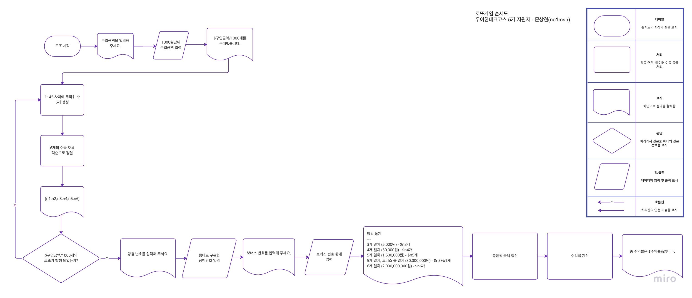

## 🎯기능 목록

- 로또 관련 기능 - `Lotto.kt` : `Class`
  - 로또가 유효한지 확인한다. - `init`
  - 로또의 숫자를 몇개를 맞추었는지 확인하여 등수를 알려준다. - `checkMyLotto()`

- 당첨등수 관련 기능 - `Win.kt` : `Enum Class`
  - 로또의 당첨등수를 알려준다. - `getMyPlace()`
  - 당첨등수에 따른 상금을 알려준다. - `getIncome()`

- 로또판매점 관련 기능 - `LottoMarket.kt` : `Class`
  - 1 ~ 45까지의 중복되지 않는 숫자 6개를 뽑는다. - `createLotto()`
  - 사용자가 로또를 구입하려는 금액에 맞추어 로또를 발행한다. - `buyLottos()`
  - 사용자가 구매하려는 금액에 맞춘 로또의 개수를 알려준다. - `getTheNumberOfLotto()`

- 은행 관련 기능 - `Bank.kt` : `Class`
  - 당첨통계를 작성한다. - `writeWinStastic()`
  - 총 얻은 수익을 가져온다. - `getTotalIncome()`
  - 수익률을 계산한다. - `getRateOfReturn()`

- 사용자 입출력 관련 기능 - `UI.kt` : `Class`
  - 입력
    - 구입금액을 입력한다. - `inputPurchasingAmount()`
    - 당첨 번호를 입력한다. - `inputWinNumbers()`
    - 보너스 번호를 입력한다. - `inputBonusNumber()`
  - 출력
    - 빈줄을 출력한다. - `printBlankLine()`
    - 구입금액을 입력해달라는 문장을 출력한다. - `printRequestPuchasingAmount()`
    - 몇장의 로또를 구매했는지 출력한다. - `printTheNumberOfLotto()`
    - 구매한 로또들의 번호를 각각 출력한다. - `printBlankLine()`
    - 당첨통계를 출력한다. - `printBlankLine()`
    - 수익률을 출력한다. - `printBlankLine()`

- 예외
  - 사용자가 잘못된 값을 입력할 경우 `IllegalArgumentException`를 발생시키고, "[ERROR]로 시작하는 에러 메시지를 출력후 종료한다."

---

### 💭 로또 게임의 큰 흐름을 한눈에 보기 위한 순서도

[🔍 로또 게임 순서도 웹에서 자세히보기 (위 이미지는 해상도가 낮습니다.)](https://miro.com/app/board/uXjVPEGQS9s=/?share_link_id=887907216201)

---

## ✅ 체크리스트

- [x] kotlin 코드 컨벤션 가이드를 지켰는가?
- [x] 변수, 또는 메소드 이름을 통해 의미를 전달 했는가?
- [x] indent depth가 3이 넘지 않도록 구현 했는가?
- [x] 메소드가 한 가지 일만 하는가?
- [x] AssertJ를 이용하여 기능 목록이 정상 동작함을 테스트 코드로 확인 했는가?
- [x] `camp.nextstep.edu.missionutils`에서 제공하는 API를 사용하여 구현 했는가?
- [x] 깃 커밋 메시지 컨벤션 가이드를 지켰는가?
- [x] 함수(또는 메소드)의 길이가 15라인을 넘어가지 않았는가?
- [x] `else`를 지양했는가?
- [x] `Enum`클래스를 적용해 프로그래밍을 구현했는가?
- [x] 도메인 로직에 단위 테스트를 구현했는가?
- [x] 제공된 Lotto 클래스를 활용해 구현했는가?
- [x] Lotto에 매개 변수가 없는 생성자를 추가하지 않았는가?
- [x] numbers의 접근 제어자인 private을 변경하지 않았는가?
- [x] Lotto에 필드를 추가하지 않았는가?